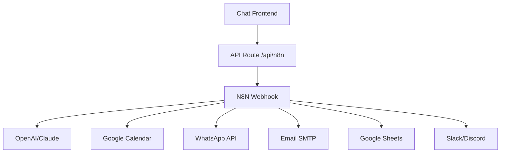

# 🔧 Configuração N8N - Sistema de Chat Avançado

## 📋 Índice

1. [Visão Geral](#visão-geral)
2. [Instalação do N8N](#instalação-do-n8n)
3. [Configuração do Webhook](#configuração-do-webhook)
4. [Workflows Recomendados](#workflows-recomendados)
5. [Integração com Google Calendar](#integração-com-google-calendar)
6. [Configuração WhatsApp Business](#configuração-whatsapp-business)
7. [Monitoramento e Logs](#monitoramento-e-logs)
8. [Troubleshooting](#troubleshooting)

---

## 🎯 Visão Geral

### O que é N8N?

N8N é uma ferramenta de automação que conecta diferentes serviços através de workflows visuais. No sistema Reservei Viagens, ele:

- 🤖 **Processa mensagens** do chat inteligente
- 📅 **Cria eventos** no Google Calendar automaticamente
- 📱 **Integra com WhatsApp** Business API
- 📧 **Envia notificações** por email
- 📊 **Gera relatórios** de conversões

### Arquitetura do Sistema



---

## 🛠️ Instalação do N8N

### Opção 1: N8N Cloud (Recomendado)

#### Vantagens:
- ✅ Sem configuração de servidor
- ✅ Escalabilidade automática
- ✅ Backups automáticos
- ✅ SSL/HTTPS incluído

#### Passos:
1. Acesse [n8n.cloud](https://n8n.cloud)
2. Crie uma conta
3. Escolha um plano (Free tier disponível)
4. Anote a URL do seu workspace: `https://seu-workspace.app.n8n.cloud`

### Opção 2: Self-Hosted (Docker)

#### Pré-requisitos:
- Docker e Docker Compose instalados
- Servidor Linux (Ubuntu 20.04+ recomendado)
- Domínio próprio com SSL

#### Instalação:
```bash
# 1. Criar diretório do projeto
mkdir n8n-reservei && cd n8n-reservei

# 2. Criar docker-compose.yml
cat > docker-compose.yml << 'EOF'
version: '3.8'

services:
  n8n:
    image: n8nio/n8n
    container_name: n8n-reservei
    restart: unless-stopped
    ports:
      - "5678:5678"
    environment:
      - DB_TYPE=postgresdb
      - DB_POSTGRESDB_HOST=postgres
      - DB_POSTGRESDB_PORT=5432
      - DB_POSTGRESDB_DATABASE=n8n
      - DB_POSTGRESDB_USER=n8n
      - DB_POSTGRESDB_PASSWORD=n8n_password
      - N8N_BASIC_AUTH_ACTIVE=true
      - N8N_BASIC_AUTH_USER=admin
      - N8N_BASIC_AUTH_PASSWORD=sua_senha_admin
      - WEBHOOK_URL=https://seu-dominio.com
      - GENERIC_TIMEZONE=America/Sao_Paulo
    volumes:
      - n8n_data:/home/node/.n8n
    depends_on:
      - postgres

  postgres:
    image: postgres:13
    container_name: n8n-postgres
    restart: unless-stopped
    environment:
      - POSTGRES_DB=n8n
      - POSTGRES_USER=n8n
      - POSTGRES_PASSWORD=n8n_password
    volumes:
      - postgres_data:/var/lib/postgresql/data

volumes:
  n8n_data:
  postgres_data:
EOF

# 3. Iniciar os serviços
docker-compose up -d

# 4. Verificar status
docker-compose ps
```

### Opção 3: VPS/Servidor Dedicado

```bash
# 1. Instalar Node.js 18+
curl -fsSL https://deb.nodesource.com/setup_18.x | sudo -E bash -
sudo apt-get install -y nodejs

# 2. Instalar N8N globalmente
sudo npm install -g n8n

# 3. Configurar variáveis de ambiente
export N8N_BASIC_AUTH_ACTIVE=true
export N8N_BASIC_AUTH_USER=admin
export N8N_BASIC_AUTH_PASSWORD=sua_senha
export WEBHOOK_URL=https://seu-dominio.com
export GENERIC_TIMEZONE=America/Sao_Paulo

# 4. Iniciar N8N
n8n start --tunnel
```

---

## 🔗 Configuração do Webhook

### 1. Criar Webhook no N8N

1. **Acesse sua instância N8N**
2. **Crie novo workflow**
3. **Adicione node "Webhook"**:
   - **HTTP Method**: POST
   - **Path**: `reservei-chat`
   - **Response Mode**: Respond to Webhook

### 2. Configurar Variáveis de Ambiente

```env
# .env.local (projeto Next.js)
N8N_WEBHOOK_URL=https://seu-workspace.app.n8n.cloud/webhook/reservei-chat
N8N_API_KEY=sua_api_key_opcional
NEXT_PUBLIC_N8N_WEBHOOK_URL=https://seu-workspace.app.n8n.cloud/webhook/reservei-chat
```

### 3. Testar Webhook

```bash
# Teste via cURL:
curl -X POST https://seu-workspace.app.n8n.cloud/webhook/reservei-chat \
  -H "Content-Type: application/json" \
  -d '{
    "sessionId": "test_123",
    "message": "Olá, teste do webhook",
    "messageType": "text",
    "userInfo": {
      "name": "Teste",
      "email": "teste@exemplo.com"
    }
  }'
```

---

## 🔄 Workflows Recomendados

### 1. Workflow Principal: Chat Processor

```json
{
  "name": "Reservei Chat Processor",
  "nodes": [
    {
      "parameters": {
        "path": "reservei-chat",
        "responseMode": "respondToWebhook",
        "options": {}
      },
      "name": "Webhook Chat",
      "type": "n8n-nodes-base.webhook",
      "position": [240, 300]
    },
    {
      "parameters": {
        "conditions": {
          "string": [
            {
              "value1": "={{$json.messageType}}",
              "operation": "equal",
              "value2": "booking_data"
            }
          ]
        }
      },
      "name": "Is Booking Data?",
      "type": "n8n-nodes-base.if",
      "position": [460, 300]
    },
    {
      "parameters": {
        "model": "gpt-3.5-turbo",
        "messages": [
          {
            "role": "system",
            "content": "Você é a Serena, consultora de turismo da Reservei Viagens especializada em Caldas Novas. Responda de forma amigável e prestativa em português brasileiro."
          },
          {
            "role": "user", 
            "content": "={{$json.message}}"
          }
        ],
        "options": {
          "temperature": 0.7,
          "maxTokens": 200
        }
      },
      "name": "OpenAI GPT",
      "type": "n8n-nodes-base.openAi",
      "position": [680, 200]
    },
    {
      "parameters": {
        "calendar": "primary",
        "summary": "Reserva Caldas Novas - {{$json.userInfo.name}}",
        "description": "Reserva criada via chat Serena\n\nCliente: {{$json.userInfo.name}}\nEmail: {{$json.userInfo.email}}\nTelefone: {{$json.userInfo.phone}}\n\nCheck-in: {{$json.bookingData.checkIn}}\nCheck-out: {{$json.bookingData.checkOut}}\nAdultos: {{$json.bookingData.adults}}\nCrianças: {{$json.bookingData.children}}",
        "start": "{{$json.bookingData.checkIn}}T14:00:00",
        "end": "{{$json.bookingData.checkOut}}T12:00:00"
      },
      "name": "Create Calendar Event",
      "type": "n8n-nodes-base.googleCalendar",
      "position": [680, 400]
    },
    {
      "parameters": {
        "to": "reservas@reserveiviagens.com.br",
        "subject": "Nova Reserva - {{$json.userInfo.name}}",
        "text": "Uma nova reserva foi criada:\n\nCliente: {{$json.userInfo.name}}\nEmail: {{$json.userInfo.email}}\nPeriodo: {{$json.bookingData.checkIn}} a {{$json.bookingData.checkOut}}",
        "options": {}
      },
      "name": "Send Email Notification",
      "type": "n8n-nodes-base.emailSend", 
      "position": [900, 400]
    },
    {
      "parameters": {
        "respondWith": "json",
        "responseBody": {
          "reply": "={{ $node['OpenAI GPT'].json.choices[0].message.content || 'Obrigada pelo contato! Em breve um consultor entrará em contato.' }}",
          "isHuman": false,
          "type": "text",
          "metadata": {
            "processedAt": "={{$now}}",
            "aiModel": "gpt-3.5-turbo"
          }
        }
      },
      "name": "Response Normal",
      "type": "n8n-nodes-base.respondToWebhook",
      "position": [900, 200]
    },
    {
      "parameters": {
        "respondWith": "json",
        "responseBody": {
          "reply": "✅ Perfeito! Sua reserva foi agendada. Nossa equipe entrará em contato em breve para confirmar todos os detalhes!",
          "isHuman": false,
          "type": "calendar_confirmation",
          "metadata": {
            "calendarEventId": "={{$node['Create Calendar Event'].json.id}}",
            "eventUrl": "={{$node['Create Calendar Event'].json.htmlLink}}",
            "consultorNotified": true
          }
        }
      },
      "name": "Response Booking",
      "type": "n8n-nodes-base.respondToWebhook",
      "position": [1120, 400]
    }
  ],
  "connections": {
    "Webhook Chat": {
      "main": [
        [
          {
            "node": "Is Booking Data?",
            "type": "main",
            "index": 0
          }
        ]
      ]
    },
    "Is Booking Data?": {
      "main": [
        [
          {
            "node": "Create Calendar Event",
            "type": "main",
            "index": 0
          }
        ],
        [
          {
            "node": "OpenAI GPT",
            "type": "main",
            "index": 0
          }
        ]
      ]
    },
    "OpenAI GPT": {
      "main": [
        [
          {
            "node": "Response Normal",
            "type": "main",
            "index": 0
          }
        ]
      ]
    },
    "Create Calendar Event": {
      "main": [
        [
          {
            "node": "Send Email Notification",
            "type": "main",
            "index": 0
          }
        ]
      ]
    },
    "Send Email Notification": {
      "main": [
        [
          {
            "node": "Response Booking",
            "type": "main",
            "index": 0
          }
        ]
      ]
    }
  }
}
```

### 2. Como Importar o Workflow

1. **Copie o JSON acima**
2. **No N8N, vá em "Workflows" > "Import from JSON"**
3. **Cole o código e clique "Import"**
4. **Configure as credenciais necessárias**

---

## 📅 Integração com Google Calendar

### 1. Configurar Credenciais Google

#### Criar Projeto no Google Cloud:
1. Acesse [Google Cloud Console](https://console.cloud.google.com)
2. Crie novo projeto: "Reservei Viagens N8N"
3. Ative a **Google Calendar API**

#### Criar Conta de Serviço:
1. Vá em **IAM & Admin > Service Accounts**
2. Clique **Create Service Account**:
   - **Name**: `reservei-calendar-service`
   - **Description**: `Conta para integração N8N com Google Calendar`
3. **Create Key** > **JSON** > Download

#### Configurar Agenda Compartilhada:
1. Abra **Google Calendar**
2. Crie nova agenda: "Reservas Reservei Viagens"
3. **Configurações** > **Compartilhar com pessoas específicas**
4. Adicione o email da conta de serviço com permissão de **edição**

### 2. Configurar no N8N

#### Adicionar Credenciais:
1. **N8N > Credentials > Add Credential**
2. Escolha **Google Service Account**
3. **Upload** o arquivo JSON baixado
4. **Test Connection**

#### Configurar Node do Calendar:
```json
{
  "parameters": {
    "calendar": "ID_DA_SUA_AGENDA",
    "operation": "create",
    "summary": "Reserva {{$json.userInfo.name}} - {{$json.bookingData.totalDays}} dias",
    "description": "📋 NOVA RESERVA VIA CHAT\n\n👤 Cliente: {{$json.userInfo.name}}\n📧 Email: {{$json.userInfo.email}}\n📱 Telefone: {{$json.userInfo.phone}}\n\n📅 Check-in: {{$json.bookingData.checkIn}}\n📅 Check-out: {{$json.bookingData.checkOut}}\n🏨 Período: {{$json.bookingData.totalDays}} dias\n\n👥 Pessoas:\n• Adultos: {{$json.bookingData.adults}}\n• Crianças: {{$json.bookingData.children}}\n• Bebês: {{$json.bookingData.babies}}\n\n🎯 Interesses: {{$json.bookingData.interests}}\n\n⚠️ AÇÃO: Entrar em contato para finalizar reserva",
    "start": "{{$json.bookingData.checkIn}}T14:00:00",
    "end": "{{$json.bookingData.checkOut}}T12:00:00",
    "timeZone": "America/Sao_Paulo"
  }
}
```

---

## 📱 Configuração WhatsApp Business

### 1. WhatsApp Business API

#### Opções Disponíveis:
- **Meta Business** (oficial, mais complexo)
- **Twilio WhatsApp** (mais fácil, pago)
- **ChatAPI** (não oficial, mais barato)

### 2. Configuração com Twilio (Recomendado)

#### Setup:
1. Crie conta no [Twilio](https://www.twilio.com)
2. Ative **WhatsApp Business API**
3. Configure número de telefone
4. Obtenha credenciais:
   - Account SID
   - Auth Token
   - WhatsApp Number

#### Node N8N para WhatsApp:
```json
{
  "parameters": {
    "resource": "message",
    "operation": "send",
    "from": "whatsapp:+14155238886",
    "to": "whatsapp:{{$json.userInfo.phone}}",
    "body": "Olá {{$json.userInfo.name}}! 👋\n\nRecebemos sua solicitação de reserva para Caldas Novas:\n\n📅 {{$json.bookingData.checkIn}} a {{$json.bookingData.checkOut}}\n👥 {{$json.bookingData.totalDays}} dias para {{$json.bookingData.adults + $json.bookingData.children + $json.bookingData.babies}} pessoas\n\nNosso consultor entrará em contato em breve!\n\n🏨 Reservei Viagens"
  },
  "name": "Send WhatsApp",
  "type": "n8n-nodes-base.twilio"
}
```

---

## 📊 Monitoramento e Logs

### 1. Dashboard de Métricas

#### Workflow de Relatórios:
```json
{
  "name": "Daily Report Generator",
  "nodes": [
    {
      "parameters": {
        "rule": {
          "interval": [
            {
              "field": "hour",
              "triggerAtMinute": 0
            }
          ]
        }
      },
      "name": "Schedule Daily Report",
      "type": "n8n-nodes-base.cron"
    },
    {
      "parameters": {
        "operation": "executeQuery",
        "query": "SELECT COUNT(*) as total_chats, COUNT(CASE WHEN messageType = 'booking_data' THEN 1 END) as bookings FROM chat_logs WHERE DATE(created_at) = CURDATE()"
      },
      "name": "Get Chat Stats",
      "type": "n8n-nodes-base.mysql"
    },
    {
      "parameters": {
        "to": "gestao@reserveiviagens.com.br",
        "subject": "Relatório Diário - {{$now.format('DD/MM/YYYY')}}",
        "text": "📊 RELATÓRIO DIÁRIO CHAT SERENA\n\n💬 Total de conversas: {{$node['Get Chat Stats'].json[0].total_chats}}\n📅 Agendamentos: {{$node['Get Chat Stats'].json[0].bookings}}\n📈 Taxa de conversão: {{($node['Get Chat Stats'].json[0].bookings / $node['Get Chat Stats'].json[0].total_chats * 100).toFixed(1)}}%"
      },
      "name": "Send Daily Report",
      "type": "n8n-nodes-base.emailSend"
    }
  ]
}
```

### 2. Logs de Erro

#### Configurar Alertas:
```json
{
  "parameters": {
    "conditions": {
      "boolean": [
        {
          "value1": "={{$json.success}}",
          "operation": "equal",
          "value2": false
        }
      ]
    }
  },
  "name": "Check for Errors",
  "type": "n8n-nodes-base.if"
}
```

---

## 🚨 Troubleshooting

### Problemas Comuns

#### 1. Webhook não responde
```bash
# Verificar status do N8N:
curl -I https://seu-workspace.app.n8n.cloud/webhook/reservei-chat

# Verificar logs:
docker logs n8n-reservei -f
```

#### 2. Google Calendar não cria eventos
- ✅ Verificar se conta de serviço tem permissões
- ✅ Confirmar ID da agenda está correto
- ✅ Testar credenciais no N8N

#### 3. OpenAI retorna erro
```json
{
  "error": {
    "message": "Rate limit exceeded",
    "type": "rate_limit_error"
  }
}
```
**Solução**: Adicionar delay entre requests ou upgradar plano OpenAI

#### 4. Chat fica "offline"
- ✅ Verificar variáveis de ambiente
- ✅ Testar webhook manualmente
- ✅ Verificar logs do console (F12)

### Logs Úteis

```bash
# N8N self-hosted logs:
docker logs n8n-reservei -f --tail 100

# Verificar execuções no N8N:
# Interface web > Executions > Filtrar por erro

# Logs do Next.js:
# Console do navegador (F12) > Network tab
```

---

## 📋 Checklist de Configuração

### ✅ Configuração Básica
- [ ] N8N instalado e funcionando
- [ ] Webhook criado com path `/reservei-chat`
- [ ] Variáveis de ambiente configuradas no Next.js
- [ ] Teste de webhook funcionando

### ✅ Integrações Avançadas
- [ ] Google Calendar configurado
- [ ] Conta de serviço com permissões
- [ ] Agenda compartilhada criada
- [ ] Teste de criação de evento

### ✅ Notificações
- [ ] Email SMTP configurado
- [ ] WhatsApp API configurado (opcional)
- [ ] Testes de envio funcionando

### ✅ Monitoramento
- [ ] Logs configurados
- [ ] Relatórios automáticos
- [ ] Alertas de erro
- [ ] Dashboard de métricas

---

## 🔗 Recursos Adicionais

### Documentação Oficial
- [N8N Documentation](https://docs.n8n.io)
- [Google Calendar API](https://developers.google.com/calendar)
- [OpenAI API](https://platform.openai.com/docs)
- [Twilio WhatsApp](https://www.twilio.com/whatsapp)

### Templates Prontos
- [N8N Template Library](https://n8n.io/workflows)
- [Reservei Workflows](./workflows/) - Pasta com workflows prontos

### Suporte
- 📧 **Email**: tech@reserveiviagens.com.br
- 📱 **WhatsApp**: (64) 99319-7555
- 💬 **Discord N8N**: [n8n.io/discord](https://n8n.io/discord)

---

**Última Atualização**: 2025-01-20  
**Versão**: 2.0  
**Compatibilidade**: N8N 1.0+, Google Calendar API v3 